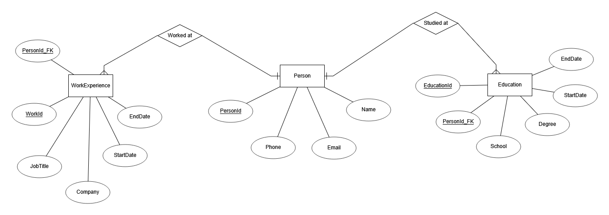

# REST-API för CV-hantering

---
# Vad du ska göra

**Databasen**

Du ska designa och skapa en databas som lagrar information om en persons utbildning och arbetslivserfarenhet.

- [x]  **Personlig information**
    - Namn, beskrivning, kontaktuppgifter.
- [x]  **Utbildningar**
    - Skola, examen, start- och slutdatum.
- [x]  **Arbetserfarenhet**
    - Jobbtitel, företag, beskrivning och år.

- [x]  Designa ett **ER-diagram** som visar hur tabellerna är relaterade.
- [x]  Skapa databasen med **Entity Framework Core** genom **Code-First**.
- [x]  Lägg upp en bild av ditt **ER-diagram** i **README-filen** i ditt Git-repo.

---

**Skapa ett REST-API**

Ditt API ska göra det möjligt att hantera information om en persons utbildningar och arbetslivserfarenhet.

Anropen till databasen ska lösas genom Entity Framework.

- [x]  **Hämta all data** (alla personer, utbildningar och jobberfarenheter).
- [x]  **Hämta en specifik post** baserat på dess ID.
- [x]  **Lägga till ny utbildning eller jobberfarenhet**.
- [x]  **Uppdatera befintlig information** (t.ex. ändra jobbtitel eller examensår).
- [x]  **Ta bort en utbildning eller jobberfarenhet**.

---

**Integrera ett externt API**

För att inkludera anrop till externa API:er ska du:

- [x]  Implementera en endpoint där en användare kan **ange sitt GitHub-användarnamn**.
- [x]  När användarnamnet anges ska API:et hämta **en lista över personens publika GitHub-repositories** via GitHub API.
- [x]  Returnera **minst** följande information:
    - Repository-namn.
    - Språk som används i repot (om inget språk anges, returnera “okänt” som värde).
    - Beskrivning av repot (om finns, annars “saknas” som värde).
    - Länk till repot.

---

**Säkerhet & validering**

För att säkerställa att API:et är robust och säkert ska du:

- [x]  Implementera **validering** för att förhindra att ogiltiga eller tomma fält skickas in.
- [x]  Säkerställ att API:et returnerar **relevanta status koder** vid olika typer av anrop.
- [ ]  EXTRA UTMANING: Förhindra att användare kan ändra eller ta bort data som de inte själva har skapat. (Frivilligt!)
